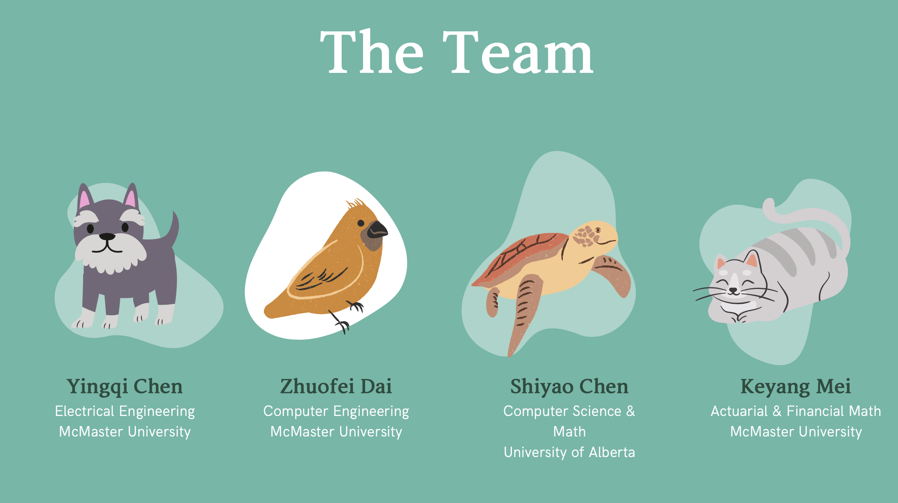
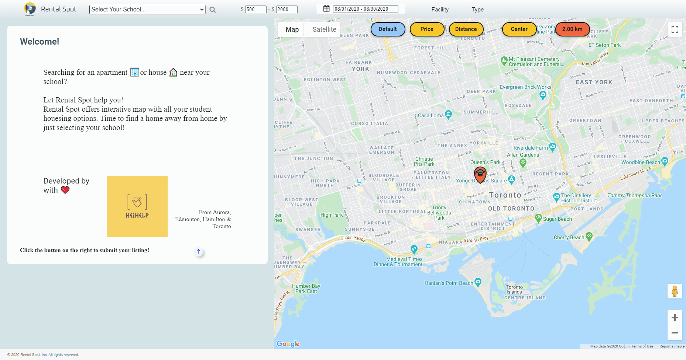
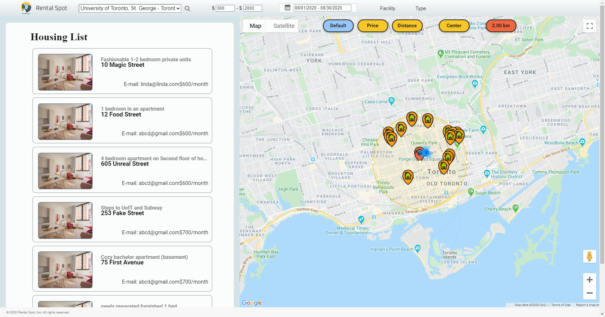
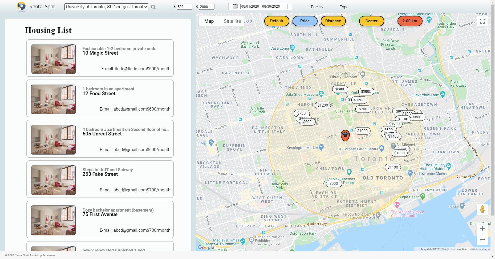
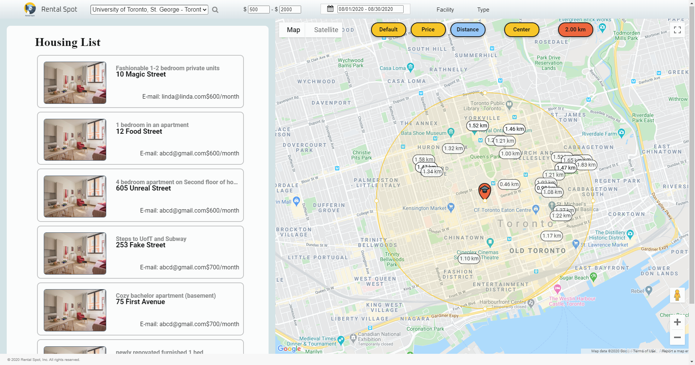

# HeiHelp
In this Repo, we create a website called Rental Spot. Rental Spot is an apartment rental website designed specifically for students. Students can find an affordable living near their school by using our user-friendly site.

# Instruction
## How to configure and access our website!

### php
* Download and run xmapp
* Enter xampp/htdocs, `git clone https://github.com/IvySYChen/HeiHelp.git`
* From control panel open Apache config - httpd.conf
* Find `DocumentRoot "/xampp/htdocs"`, change it to `DocumentRoot "/xampp/htdocs/Heihelp/RentalSpot"`
* Find `DirectoryIndex`, Add `Homepage.html`, put it in the first entry

### Sqlite3 (Windows user needs to do this step, macOS user can ignore it)
* Open xampp/php/php
* Find `extension=sqlite3`, Remove `;`

### View the website

* From control panel Start Apache
* Enter `localhost` in the browser

# Team Intro

  

## Team Individual Members Intro

### Yingqi Chen - Electrical Engineering 
* Mainly contributed to coding the basic HTML web page structure, 
  UI design and implementation (CSS and jQuery/Javascript), PHP(Ajax) 
  and sql database interaction...
  
*"This is my first time joining hackathon but I did enjoy it to the fullest. It was totally worth it though I felt a bit stressful at first that I was charged to do coding that is relevant to courses I just completed this summer. (I am so happy what I learned finally got to take apart in practice!)"*

*"I really appreciate Keyang, who invited me in the first place to this exciting competition, as well as our two other cute and skillful team members Zhuofei and Shiyao with whom I fought together to accomplish our project goal. Though last minute before submission could not be more dramatic,(as we really rushed into the last moment to submit our project work)  all turned out to be perfect in the end. Great work, friends!"*

### Zhuofei Dai - Computer Engineering
* Mainly contributed to coding the map interaction (Javascript, HTML and CSS) and data collection (Python)
        
### Keyang Mei - Actuarial & Financial Math
*

*"This is my first online Hackathon and I am so grateful that I get to do this with my awesome friends Yingqi, Zhuofei, and Shiyao🥰. I am really happy that the knowledge I just learned about database design and contribute to our project (Thank you Jane for teaching me that!) I also get to help with the UI for a little bit.
Although we encountered some problems, we were able to find the solutions at the end. Again! My teammates are the best teammates in the world!!!"*

# Presentation Slides

[Presentation](https://www.canva.com/design/DAEDhItiD6U/R65MPDLtxYgViAdzMACU5Q/view?website#2)
(OR: https://bit.ly/3kv4iOv)

- Have a look at our presentation slides! Also feel free to watch our demo video from link below!

[Demo Video](https://drive.google.com/file/d/1tXHp89IRK2K5qBDxNXhg4i_Wb_Fafnao/view)

# Pictures

  

  

  

  

